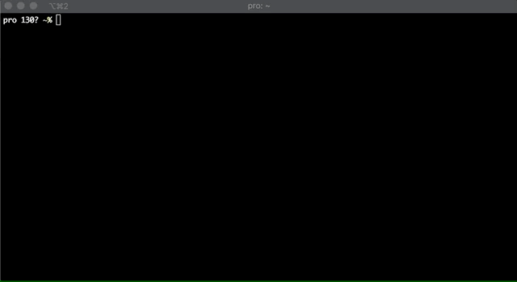

# Skyput

Upload files to [Skynet](https://siasky.net) from your command line.



## Install

### Go

```bash
go get -u github.com/termoose/skyput
```

### Homebrew

```bash
brew install termoose/tap/skyput
```

## Usage

On the first run a config file will be created for you in `~/.config/skyput`.
If you want to change the default Skynet portal you can run:
```bash
skyput -portal
```

You can modify the config file and add custom portals as well!

Start uploading to Skynet:

```bash
skyput cat_picture.jpg
```

or upload all files in the current directory!

```bash
skyput -all
```

or just your previous uploads:

```bash
skyput -list
```

you can also add `-ddg` to expose the uploaded file to [DappDappGo](https://dappdappgo.coolhd.hu) search engine.

```bash
skyput -ddg searchable_file.mp4
```

## To-do
- Find a way to only set a timeout for the response
- Add support for pushing directories
- Support encryption when it arrives
- Support resuming uploads (might noe be possible!)
- Add support /skynet/portals [GET]?
